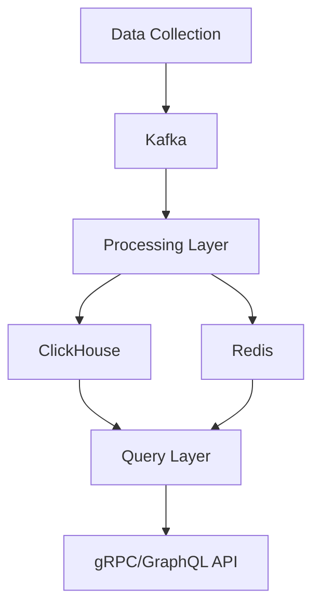

# ETH Balance Tracking System Design

## 1. System Overview
### 1.1 Purpose
A scalable system to track real-time and historical ETH balances across multiple EVM chains, supporting both contract addresses and EOAs, with comprehensive edge case handling.

### 1.2 Core Features
- Historical balance tracking
- Real-time balance monitoring
- Multi-chain support
- Edge case handling
- EOA support
- Analytics capabilities

### 1.3 Design Principles
- Scalability first
- Real-time processing
- Data accuracy
- Fault tolerance
- Chain agnostic design

## 2. System Architecture

### 2.1 High-Level Architecture


### 2.2 Component Layers

#### 2.2.1 Data Collection Layer
- **Primary Components**
  - Hypersync Client
  - Kafka Event Stream
  - Block Processor
  - Transaction Monitor

- **Responsibilities**
  - Blockchain data ingestion
  - Event streaming
  - Data validation
  - Error handling

#### 2.2.2 Storage Layer
- **Primary Components**
  - ClickHouse (Primary Storage)
  - Redis (Cache Layer)

- **ClickHouse Schema**
  ```sql
  -- Chains table
  CREATE TABLE chains (
      chain_id UInt64,
      chain_type Enum8('L1' = 1, 'L2' = 2),
      chain_config String
  ) ENGINE = ReplacingMergeTree()
  ORDER BY chain_id;

  -- Addresses table
  CREATE TABLE addresses (
      address FixedString(42),
      address_type Enum8('Contract' = 1, 'EOA' = 2),
      deployment_block UInt64,
      deployment_timestamp DateTime
  ) ENGINE = ReplacingMergeTree()
  ORDER BY address;

  -- Balances table
  CREATE TABLE balances (
      address FixedString(42),
      chain_id UInt64,
      block_number UInt64,
      timestamp DateTime,
      balance Decimal128(18),
      last_transaction_hash FixedString(66)
  ) ENGINE = ReplacingMergeTree()
  ORDER BY (address, chain_id, block_number);

  -- Transactions table
  CREATE TABLE transactions (
      chain_id UInt64,
      block_number UInt64,
      transaction_hash FixedString(66),
      from_address FixedString(42),
      to_address FixedString(42),
      value Decimal128(18),
      timestamp DateTime,
      status UInt8
  ) ENGINE = ReplacingMergeTree()
  ORDER BY (chain_id, block_number, transaction_hash);
  ```

- **Redis Cache Structure**
  ```
  Keys:
  - balance:{address}:{chain_id} -> Current balance
  - processing:{chain_id}:{block_number} -> Processing status
  - ratelimit:{client_id} -> Request count
  ```

#### 2.2.3 Processing Layer
- **Primary Components**
  - Kafka Streams
  - Balance Calculator
  - State Manager
  - Event Processor

- **Key Operations**
  - Transaction processing
  - Balance calculation
  - State management
  - Edge case handling

#### 2.2.4 Query Layer
- **Primary Components**
  - gRPC Services
  - GraphQL API
  - Query Optimizer
  - Cache Manager

- **API Interfaces**
  ```protobuf
  // gRPC Service Definition
  service BalanceService {
    rpc GetBalance(AddressRequest) returns (BalanceResponse);
    rpc StreamBalanceUpdates(AddressRequest) returns (stream BalanceUpdate);
    rpc GetHistoricalBalances(HistoricalRequest) returns (HistoricalResponse);
  }
  ```

  ```graphql
  # GraphQL Schema
  type Balance {
    address: String!
    chainId: Int!
    balance: String!
    blockNumber: Int!
    timestamp: DateTime!
  }

  type Query {
    currentBalance(address: String!, chainId: Int!): Balance
    balanceHistory(
      address: String!, 
      chainId: Int!,
      fromBlock: Int!,
      toBlock: Int
    ): [Balance]
  }

  type Subscription {
    balanceUpdates(address: String!, chainId: Int!): Balance
  }
  ```

## 3. Data Flow

### 3.1 Collection Flow
1. Hypersync Client retrieves blockchain data
2. Data is validated and normalized
3. Events are published to Kafka topics
4. Processing layer consumes events

### 3.2 Processing Flow
1. Kafka Streams process incoming events
2. Balance calculations are performed
3. State is updated in Redis
4. Permanent storage in ClickHouse

### 3.3 Query Flow
1. API request received
2. Cache check in Redis
3. If cache miss, query ClickHouse
4. Response transformation
5. Result delivery

## 4. System Components Detail

### 4.1 Kafka Topics
- raw.blocks
- raw.transactions
- raw.balance_changes
- processed.balance_updates

### 4.2 Redis Caching Strategy
- TTL-based caching
- Pub/Sub for real-time updates
- Cache invalidation on updates
- Rate limiting implementation

### 4.3 ClickHouse Optimization
- Materialized views for common queries
- Efficient indexing strategy
- Partition by chain_id
- Order by block_number

### 4.4 API Layer Design
- RESTful endpoints
- GraphQL interface
- Websocket support
- Rate limiting
- Authentication/Authorization

## 5. Cross-Cutting Concerns

### 5.1 Security
- API authentication
- Rate limiting
- Data validation
- Access control

### 5.2 Monitoring
- System metrics
- Performance monitoring
- Error tracking
- Alert system

### 5.3 Error Handling
- Retry mechanisms
- Circuit breakers
- Fallback strategies
- Error logging

### 5.4 Performance
- Caching strategy
- Query optimization
- Load balancing
- Resource scaling

## 6. Deployment Architecture

### 6.1 Infrastructure
- Kubernetes-based deployment
- Container orchestration
- Service mesh
- Load balancing

### 6.2 Scaling Strategy
- Horizontal scaling
- Auto-scaling policies
- Resource management
- Performance optimization